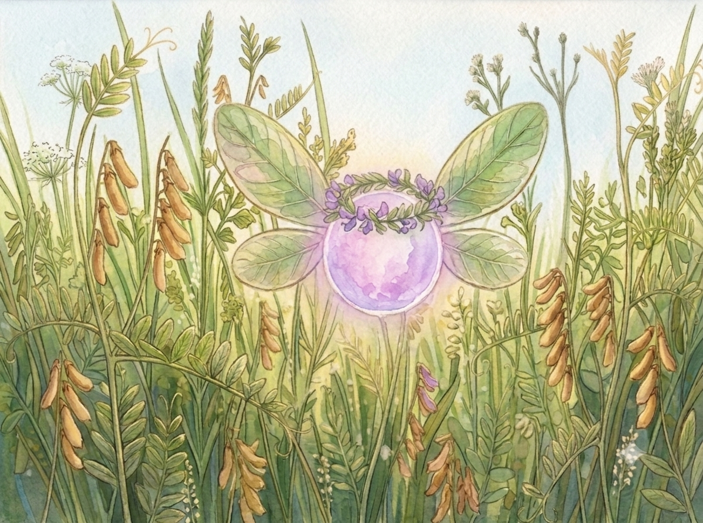

# 出会い
ーーー歌が聞こえる。

草むらに一陣の風が吹くと、まるで誰かが指揮を取っているかのように、草たちがざあざあとささやく。
耕介(こうすけ)にとって、最も心の安らぐ瞬間だった。

風の指揮棒に合わせ草たちが揺らめくと、大小さまざまな虫が踊るように飛び回る。
時折聞こえてくる鳥のさえずりも良いアクセントだ。

大自然の演奏会に浸っていると、耕介は何もかもを忘れられた。
今日も小学校の保健室で、四年生用のプリントだけもらって帰ってきたことも。
兄が農業ぐらいは学べと度々言ってくることも。
...自分がこの先、どう生きていくのかということも。

（ああ、まぶしいな。）

目の前に広がるのは、兄の耕平(こうへい)が「雑草」と呼んでいる草たちだ。
農家にとっては栄養や日光を奪う敵だと教わっていたが、耕介の目には一つ一つが輝いて映し出される。
小さな種からにじみ出る緑の光、風に揺れる葉からほとばしる白い光。そして、色とりどりの花からは黄色い光が波を打つ。
演奏会場は、いつの間にか光に包まれた舞台へと変わっていた。

（ほんと、特等席だよな）

後ろのキャンプ椅子に深く背中を預ける。
折りたたみの日傘も展開すれば、7月の暑さの中でも腰を落ち着けて鑑賞できた。

目を閉じると、サンタの格好をした養父の笑顔が思い浮かぶ。
普段は物静かな人なのに、キャンプ椅子を片手に「喜んでくれるかな？」と、その場で左右に小踊りしながら反応を伺っていた姿に、今でも頬が緩む。

養父の姿をしばらく楽しんだ後、目を閉じたまま、息を大きく吸い込み、吐き出す。
一回一回の呼吸のたび、段々と自分の意識が自然の中に溶け込んでいく...

そうしてどれほどの時間が経ったのか、ポケットの振動が耕介を現実に引き戻した。

“今日の夕飯は肉じゃがだぞ” - 17:25

スマホを取り出すと、通知欄に兄の一声が表示される。

「肉じゃがか…」

耕介は決して肉じゃがが嫌いではない。
耕平も料理が下手ではない。
むしろ、腕前は大人たちも舌鼓をうつほどだ。

しかし、肉じゃがは耕介にとって舞台会場を離れるほどの理由にはならなかった。

通知だけ見て画面を消し、仕舞おうとしたその時、再び手の中でスマホが振動する。

"食後のアイスもあるぞ" - 17:26

画面を見た瞬間、耕介は飛び上がった。

急いでキャンプ椅子を畳みリュックに仕舞うと、吸い寄せられるように家までの道のりを歩き始めた。

…その時だった

「ねぇ」

ーーー声が聞こえた。
はっきりと。
間違いなく。

草たちのささやきを受け取ってきた耕介の耳も、言葉が聞こえたことは今まで無かった。

「ねぇ」

ーーーまた声が聞こえた。
おそらく、
草畑の方から。

声に導かれるまま草畑に足を踏み入れる。
すると、自分の背丈をゆうに超える草の防壁が目の前に広がっていた。

「勝手に中には入るなよ」という耕平の言葉が思い出される。
しかし、生まれて初めて聞こえた声を無視はできなかった。

「...あった」

あたりの地面を見渡すと、近くの大きな枝が目についた。
兄にかつて言われた通り、棒を右手で握り、足元を叩きながら進んでいく。
マムシが出てくる可能性が十分にあったからだ。

残った左手で、今度は目の前の草の防壁を一つ一つかき分けながら進んでいくと、不意に顔へ何かが張り付いた。

「ぶえっ！？」

慌てて払いのけると、クモの巣だった。
誰も入っていない草むらなのだから当然だ。

左手についた糸を両手で払い落とす。
落としていた棒も拾いあげ、気を取り直して進んでいくと、

「いてっ！」

今度は、左手にうっすら切り傷ができていた。
草によっては、[葉の縁が鋭くなっているものがある。](./notes/珪酸/README.md)
軍手を用意もせず、素手で草に触れると切れることがあった。

左手に出来た傷と滲んでいる血を見ると、少し背筋が寒くなる。

（やっぱり帰ろうか）

その場で踏み留まる。
しかし瞬間、「プーン」と不快な羽音が耳に響き渡る。

「うわ！」

慌てて払いのけると、蚊はどこかに消えていった。
だが、止まっていたらまた飛んできてしまう。
戻るにしても進むにしても、立ち止まってはいられなかった。

（行こう）

やはり、耕介は歩みを止めなかった。

止められなかった。

「ねぇ！」

声が聞こえた。
さっきよりも大きく。

もはや切り傷の痛みも忘れ、草の波を泳ぐようにかき分けると...

ーーー目の前にあったのは、枯れかけの草だった。

段々ときつね色になりかけた蔓草(つるくさ)の中に、茶色く乾燥した豆のサヤのようなものがあちこちに付いていた。
大豆に似ているが大豆ではない。まだ完全に枯れていないサヤは紫がかった色を帯びている。

しかし外見とは裏腹に、サヤの中からは放射状に緑の光が溢れ出す。
あまりの眩しさに耕介は目を細めた。

「こいつ…強そうな豆だな。」

収穫してみようと、ひときわ大きな光を放つサヤに手を伸ばす。
するとその手がパッと弾かれた。

「うわっ」

驚いて目を上げると、

薄紫色の小さな光の球に、楕円形の緑の羽を生やした謎の生き物が空を飛んでいた。
球の大きさは手のひらサイズ、注意深く見ると羽の形は目の前の豆の葉にそっくりだった。

「ねぇ！」

目の前の生き物が人の言葉を喋った。

「あなたはどこから来たの？名前は？」

声は四、五歳ほどの少女を思わせる。
しかし、耕介はそれを不思議とは思わなかった。

「俺は、耕介。君こそ誰？」

「コースケ？」

目の前の生き物は、人が首を傾げるように球体の体を三十度ほど横に傾けた。

「コースケ、こんにちは！」

くるりと元に戻る。

「私はフェアリーベッチ！」

「ふぇありー…べっち？」

今度は耕介の方が小首を傾げる。
以前、耕平の話の中で[似たような名前](./notes/ヘアリーベッチ/README.md)を聞いていたはずだったが、もはや記憶の彼方に消え去っていた。

「そう！フェアリーベッチだよ！」

目の前の生き物は、空中で小気味よく後ろに宙返りする。

しかしそれもつかの間、悲しみにくれる犬の尻尾のように、フェアリーベッチの羽が萎れて下方向に垂れる。

「でもね。今のまんまだと誰の役にも立てないんだよね…」

「役に立てない？」

「そうなの。ほんとは、この土地のみんなを元気にするために来たんだけど、今は少ししか残ってなくて…」

フェアリーベッチが、周囲の豆を羽で指し示す。
そこで耕介はようやく気がついた。

「もしかして、君がこの豆なの？」

「正解！だからフェアリー"ベッチ"なんだよ。」

薄紫の球が嬉しそうに上下に揺れる。

"ベッチ"とは、マメ科の植物を意味する。
だが外国語を知らない耕介には全く意味が分からなかった。

けれど...ベッチという言葉の響きは気に入った。

「じゃあさ、もうベッチで良いかな？」

「え？」

「フェアリーベッチって長いじゃん。呼ぶときはベッチでも良い？」

不意を突かれたフェアリーベッチは、羽も動かさずに固まっていたが、

「ベッチ…」
フェアリーベッチがつぶやく。

「ベッチ…！」
二回目、球体の体がひときわ光った。

「ベッチ！！！」
三回目は叫んだ。

「気に入った！今度からベッチで良いよ！」

どうやら心が通じ合ったらしい。

状況はまだ飲み込めないが、耕介は姿の違う生き物と心を通わせた喜びに胸を躍らせていた。

「ありがとう！俺も友達欲しかったから、気に入ってもらえて嬉しいよ。」

「トモダチ？」

フェアリーベッチは、"友達"を知らないようだった。

「ええっと、友達っていうのはね…」

不意に言葉に詰まる。
最近は、一緒に外で遊ぶような友達は居ない。
一人で家でゲームをしているか、草むらに居ることがほとんどだ。

小学1,2年生の頃、まだ教室に入れていた時の記憶をなんとか引っ張り出す。
だが、一人で勇者ごっこをしていた場面ばかりが思い浮かんだ。

「友達っていうのは、一緒に遊んだり、助け合ったりするんだよ！」

仕方がないので、自分の知っている言葉で、理想の友達像を精一杯説明する。
すると、ベッチの体がまた光る。

「トモダチ…いいね！！」

そう答えると、ベッチは耕介の頭上に輪っかを作るように弧を描いて飛び周る。

「オ、トモ、ダチ！はい！
オ、トモ、ダチ！はい！！」

祭りの囃子声のようにリズムよく刻んでいく。
せっかくなので手拍子を合わせようかと思ったが、

「…あ」

急にリズムが途切れ、耕介の目の前に飛んでくる。

「オトモダチってさ…助け合い。してくれるんだっけ？」
伺うような声で尋ねてくる。

「もちろんだよ！」
初めて出来た植物の友達の頼みだ。
断る選択肢は無かった。

「じゃあさ、一個お願いがあるんだけど。」
そう言って畑を見回すと、ベッチは言葉を続ける。

「次の秋が来たらさ。ベッチの種をこの畑いっぱいに撒いて欲しいんだ…」

耕介は顔を曇らせた。
「撒くこと自体は出来るけど、ここ、うちの畑じゃないからなあ。」

「どーゆーこと？」
不思議そうなベッチに耕介は答える。

「うちじゃなくて、よその人が持ってる畑なんだよ。…まあ、その人も管理できなくて放置してるみたいだけど。」

「え！？」
ベッチが驚きの声を上げる。
耕介が申し訳無さそうに肩を落としていると...

「ニンゲンって土地持ち上げるの？巨人に変身するの！？」

絶妙にズレた返事が返ってきた。

土地の所有は分からないのに、巨人に変身というアニメでしか聞いたことのない話を繰り出すフェアリーに、耕介は笑いを堪えられなくなった。

「え〜、何笑ってるの？」
「いや、ごめん…ベッチって、面白くて。」
耕介は、口元の笑いを手で誤魔化しながら答える。

しかし、ベッチは気を悪くするどころか、

「やったー！じゃあ笑わせたからさ、お願い、聞いてくれる？」

ーーー[したたかな生き物だった。](./notes/ヘアリーベッチの花言葉/README.md)